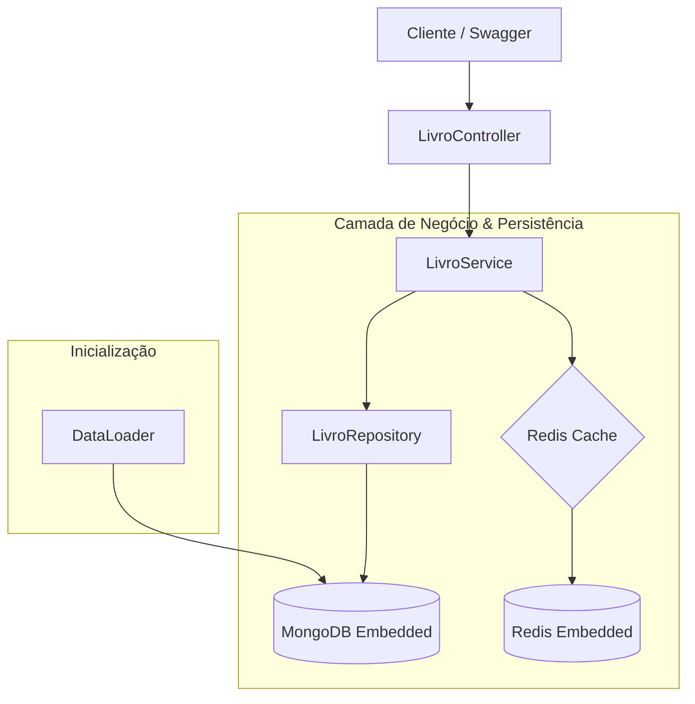

# 📚 Biblioteca Sicredi

API REST para gerenciamento de biblioteca, focada em performance com **Redis Cache** e facilidade de setup com infraestrutura **embarcada**.

---

## 🏗️ Arquitetura do Sistema

Abaixo, o fluxo de dados e a integração entre os componentes:

---

## 🚀 Tecnologias e Stack

- **Linguagem:** Java 21
- **Framework:** Spring Boot 3.4.5
- **Dados:** MongoDB (Persistência) & Redis (Cache)
- **Infra:** Bases embarcadas (roda sem Docker/Instalação local)
- **Docs:** SpringDoc OpenAPI (Swagger)
- **Produtividade:** Lombok & MapStruct

---

## ⚡ Funcionalidades

- **CRUD Completo:** Gerenciamento de livros com validações.
- **Cache-Aside Pattern:**
  - `GET /{id}`: Busca no Redis antes do MongoDB.
  - `PUT`/`DELETE`: Invalidação automática do cache.
- **Listagem Otimizada:** Paginação obrigatória para evitar sobrecarga.
- **Carga Inicial:** Dados pré-populados ao iniciar a aplicação.

---

## 📋 Interface da API

| Método | Endpoint | Descrição |
| :--- | :--- | :--- |
| `POST` | `/livros` | Cadastra novo livro |
| `GET` | `/livros/{id}` | Detalhes (com cache) |
| `GET` | `/livros` | Lista paginada |
| `PUT` | `/livros/{id}` | Atualiza dados |
| `DELETE` | `/livros/{id}` | Remove registro |

> **Documentação Interativa:** [http://localhost:8080/swagger-ui.html](http://localhost:8080/swagger-ui.html)

---

## ⚙️ Como Executar

1. **Requisitos:** JDK 21 e Maven.
2. **Setup:** Importe o projeto na sua IDE (STS, IntelliJ, VS Code).
3. **Execução:** Rode a classe `BibliotecaApplication`.
4. **Pronto:** Os bancos subirão automaticamente junto com o Spring.

---